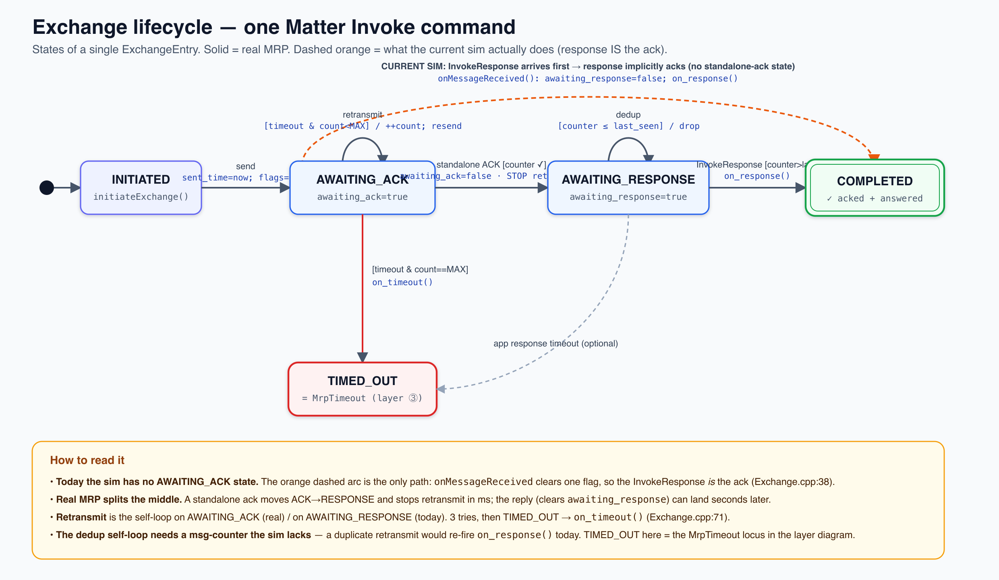
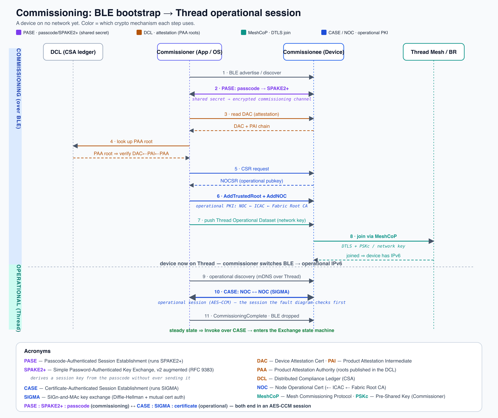
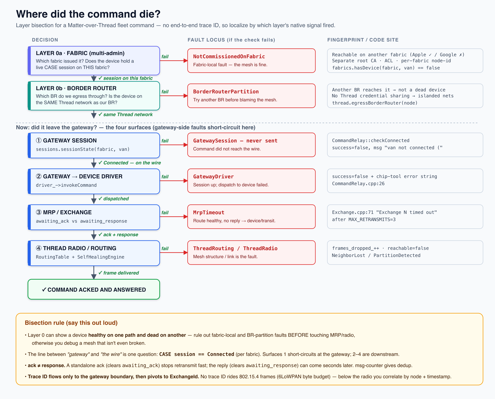
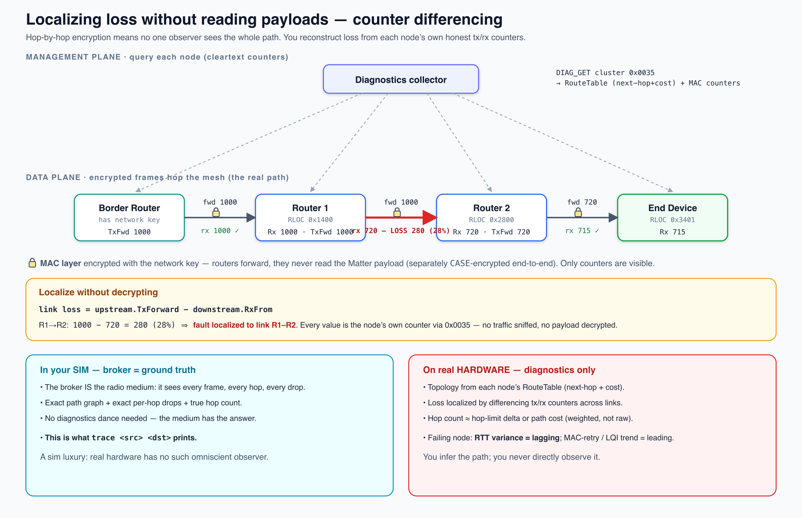

# Debugging & Observability: Matter-over-Thread

How a command flows through the system, where it can fail, what you can observe
under **default conditions** vs. with an opt-in **tracer**, and how the simulation
models all of it.

This doc ties together four diagrams (in [`docs/diagrams/`](diagrams/)):

| Diagram | What it answers |
|---|---|
| `commissioning-sequence` | How the secure session is born (BLE → Thread) |
| `fault-localization-layers` | Where a command dies |
| `exchange-state-machine` | The MRP lifecycle of one command |
| `loss-localization` | How to localize loss without reading payloads |

---

## 1. What is "a command"?

Throughout, **command** means a Matter Interaction Model **Invoke** — "run this
action on this device." It is a triple plus optional arguments:

```
CommandPath = { EndpointId, ClusterId, CommandId }   + optional TLV-encoded fields
```

Example (unlock a van's cargo door):

```
Endpoint 1 · Cluster 0x0101 (Door Lock) · Command 0x01 (UnlockDoor) · { PINCode }
```

The same logical command wears a different costume at each layer — which is *why
a single trace ID can't follow it end to end*:

| Layer | What the command IS there |
|---|---|
| iOS SDK / intent | an `InvokeCommand` struct |
| Gateway `CommandRelay` | `driver_->invokeCommand(ep, cluster, cmd, payload)` → `chip-tool ...` |
| Matter IM | an **InvokeRequest** (IM opcode `0x08`) → `initiateExchange(session, 0x01, 0x08)`, gets an **ExchangeId** |
| Encoding | TLV-encoded, wrapped in a secure Matter message with a **message counter**, AES-CCM encrypted under the CASE key |
| Transport | UDP/IPv6 → **6LoWPAN**-compressed → one or more **802.15.4 frames** (each with its own `seq_number`) |

One logical command = an `InvokeCommand` at the gateway = an `ExchangeId` at the
Matter layer = several `seq_number`s on the radio. **Three different ID spaces.**

---

## 2. Transport: the TCP → UDP boundary

Northbound (app/cloud → gateway) is TCP/TLS. Southbound (gateway → device over
Thread) is **UDP/IPv6 + MRP**. Crossing that line:

| Lost (TCP gave it free) | Who picks it up |
|---|---|
| In-order delivery | nobody — Matter exchanges are independent |
| Retransmission | **MRP**, per-message — not per-segment |
| Congestion / flow control | app-level backoff (Thread is ~250 kbps) |
| Connection state, byte-stream framing | gone — each message is a self-contained datagram |
| Head-of-line blocking | **eliminated** — one lost message doesn't stall the rest |

**Fragmentation amplification** (the non-obvious one): an 802.15.4 frame is ~127
bytes. A UDP datagram larger than that is split by 6LoWPAN into N fragments, and
**6LoWPAN reassembly is all-or-nothing** — lose one fragment and the *entire*
datagram drops, then MRP retransmits the whole thing. TCP would have retransmitted
just the missing segment. So effective loss scales with fragment count, which is
why Matter keeps messages small. Per-*link* reliability still exists (802.15.4 MAC
acks + retries); it's the end-to-end *datagram* that's fragile.

The sim models this directly. A datagram of N fragments arrives only if **every
fragment survives every hop**, so:

```
datagramDelivery(bytes) = cumulativeDelivery() ^ ceil(bytes / 80)
```

`TraceResult::deliveryForSize()` computes it; the `probe <src> <dst>` command shows
the falloff. Example — a van phone→sensor path that is 98% good for a single frame:

```
> probe 3 2
Size probe 3 -> 2  (topology=van, single-frame delivery 98.0%):
    32 B  ->  1 fragment    delivery 98.0%
   256 B  ->  4 fragments   delivery 92.2%   <== fragmentation amplification
  1024 B  -> 13 fragments   delivery 76.9%   <== fragmentation amplification
```

A 2% per-frame loss becomes ~23% datagram loss for a 1 KB transfer. This is also
why a periodic **size probe** (small vs. large) is a better link-health signal than
PMTUD inside a Thread mesh — the IPv6 MTU is a fixed 1280 there (6LoWPAN fragments
it), so PMTUD reveals nothing, but fragment-survival reveals marginality early.

---

## 3. MRP: ack ≠ response



Reliability lives in `ExchangeManager` (`src/matter/Exchange.{h,cpp}`). The key
distinction:

- **MRP standalone ack** — Secure Channel message (protocol `0x00`, opcode `0x10`).
  Says only *"I received message counter N."* Stops retransmit fast. No result.
- **InvokeResponse** — IM opcode `0x09`. The actual outcome (`SUCCESS`, a status,
  or response fields).

For a door unlock these can be **seconds apart**: the lock acks the radio message
instantly, then takes a beat to throw the bolt and report `SUCCESS`.

### Current sim vs. real MRP

The sim **collapses ack and response into one event**: `onMessageReceived` clears a
single `awaiting_response` flag (`Exchange.cpp:38`), so the InvokeResponse *is* the
ack, and retransmit is driven by that one flag. Consequences:

1. A slow-but-successful reply (>30 s) triggers a **spurious retransmit**.
2. **No dedup** — a duplicate retransmit would re-fire `on_response()` (no message
   counter check).
3. `FLAG_ACK_REQ` (`Frame.h:21`) is a dead reserved bit.

Real MRP splits the middle state (`AWAITING_ACK` → `AWAITING_RESPONSE`): a standalone
ack clears `awaiting_ack` (stops retransmit) while `awaiting_response` is cleared
independently by the reply; a message counter provides dedup. Terminals:
`COMPLETED` (acked **and** answered) and `TIMED_OUT` (3 retransmits exhausted →
`on_timeout()`, `Exchange.cpp:71`).

> **Known sim bug:** `initiateExchange()` never sets `sent_time`, so it defaults to
> epoch — `elapsed = now - sent_time` is enormous and the first `tick()` retransmits
> immediately. The fix is `entry.sent_time = now;` at send.

---

## 4. Commissioning: how the session is born



A fresh device is on **no IP network**, so BLE is the bootstrap transport. Three
distinct mechanisms — easy to conflate:

| Concept | Job | Crypto |
|---|---|---|
| **PASE / CASE** | Matter *session* security | PASE = shared-secret (SPAKE2+); CASE = **PKI** (certs, SIGMA) |
| **DCL** | Device *attestation* — "is this a genuine certified device?" | publishes **PAA roots**, not session keys |
| **DTLS** | Not in the Matter session path — lives in **Thread MeshCoP** join | DTLS + PSKc |

Two separate PKIs:

- **Attestation PKI** (factory identity): `DAC ← PAI ← PAA`, PAA roots in the **DCL**.
- **Operational PKI** (fabric membership, minted at commissioning): `NOC ← ICAC ←
  Fabric Root CA`. This is what **CASE** uses for every operational session.

Flow: BLE discover → **PASE** (passcode→SPAKE2+) → **attestation** (verify DAC chain
to a PAA root from the DCL) → CSR → **AddNOC** (operational PKI) → push Thread dataset
→ device joins mesh via **MeshCoP/DTLS** → operational discovery (mDNS) → **CASE** over
Thread → `CommissioningComplete` (BLE dropped) → steady-state Invokes ride the CASE
session.

> **Acronyms:** PASE = Passcode-Authenticated Session Establishment; SPAKE2+ = Simple
> Password-Authenticated Key Exchange v2 augmented (RFC 9383); CASE =
> Certificate-Authenticated Session Establishment; SIGMA = SIGn-and-MAc key exchange;
> DAC/PAI/PAA = Device Attestation Cert ← Product Attestation Intermediate ← Authority;
> NOC = Node Operational Cert; DCL = Distributed Compliance Ledger; MeshCoP = Mesh
> Commissioning Protocol; PSKc = Pre-Shared Key (Commissioner).

In the sim, PASE/CASE crypto is **stubbed** and there is no DCL/attestation — both are
real-world layers the sim abstracts away.

---

## 5. Where a command dies: layered bisection



There is **no end-to-end trace ID**, so you localize by *which layer's native signal
fired*. "Did it leave the gateway?" is actually **three** questions:

**Layer 0a · Fabric (multi-admin).** A device is commissioned to N fabrics (Apple,
Google, Alexa, your fleet) simultaneously — each with its own CASE session, ACL, and
node-id. A command failing on one fabric says nothing about another.
→ fault `NotCommissionedOnFabric`. Check: reachable on a *different* fabric?

**Layer 0b · Border Router.** The BR (HomePod, Nest Hub, …) is the IPv6↔802.15.4
bridge — **not** the Matter controller. Multiple BRs can serve one Thread network;
fabric ≠ Thread network. If credential sharing isn't in effect you get islanded
networks. → fault `BorderRouterPartition`. Check: can another BR reach it?

Then the four surfaces (the `CASE session == Connected` line divides gateway from wire):

| Surface | Code site | Fingerprint |
|---|---|---|
| ① Gateway session | `CommandRelay::checkConnected` | `success=false`, msg `"van not connected ("` — never sent |
| ② Gateway→device driver | `driver_->invokeCommand` (`CommandRelay.cpp:26`) | session up, chip-tool error string |
| ③ MRP / Exchange | `Exchange.cpp:71` | `"Exchange N timed out"` after `MAX_RETRANSMITS=3` |
| ④ Thread radio/routing | broker / SelfHealing | `frames_dropped_++`, `reachable=false`, `NeighborLost`/`PartitionDetected` |

**The rule:** Layer 0 can show a device healthy on one path and dead on another — rule
out fabric-local and BR-partition faults *before* touching MRP/radio, or you debug a
mesh that isn't even broken.

---

## 6. Observability under default conditions

The central constraint: the mesh is **hop-by-hop encrypted** (MAC layer with the
network key; Matter payload with the per-pair CASE key) and uses **rotating
identifiers**, so no single observer sees the whole path. You learn things in tiers:

| Tier | Cost | What you learn |
|---|---|---|
| **0 · Pure passive** (controller only) | nothing | success/fail, **RTT + variance**, your own **MRP retransmit count** |
| **1 · Standard diagnostics** (poll cluster `0x0035`) | a few queries | **topology** (RouteTable next-hop+cost), per-neighbor **LQI/RSSI**, MAC/IP counters → loss localized by **differencing** counters across a link |
| **2 · Tracer mode** (instrumentation you build) | bytes on-wire + privacy | actual **per-packet path** |

Answering the practical questions under **Tier 0 default**:

- **Node graph?** No, not passively — the packet carries no path. You *infer* a graph
  at Tier 1 by polling RouteTables.
- **Hop count?** Only approximately, at Tier 1 — IPv6 hop-limit delta (if echoed) or
  RouteTable path cost (quality-weighted, not raw hops).
- **Which link dropped?** No at Tier 0 — relays don't report per-packet and counters
  are aggregate. Tier 1 counter-differencing localizes it.
- **Failing node?** **Yes at Tier 0**, but only as a *symptom* (RTT variance + rising
  retransmit count). The *where* and the *leading* indicators (LQI trend, MAC-retry
  climb) are Tier 1.

### Loss localization by counter differencing (Tier 1)



You never read payloads. You read each node's own honest counters via `0x0035` and
difference them across a link:

```
link loss = upstream.TxForward − downstream.RxFrom
```

A gap localizes the lossy link, privacy intact.

---

## 7. Tracer mode (Tier 2) — opt-in

Tracer mode breaks past the Tier-0/1 ceiling. It is **never default** because it fights
both the byte budget and the privacy model. Real-world mechanisms:

- **Hop-recording header** (IPv6 Hop-by-Hop / Record-Route option): each forwarding
  router appends its RLOC to a header option. Gives the true path — but adds bytes
  (→ more 6LoWPAN fragmentation) and leaks topology, so it's a debug-only toggle. *This
  is the canonical field technique.*
- **Correlation-ID + per-router logging**: stamp an ID at the gateway, each router logs
  "forwarded ID X", stitch the path post-hoc.
- **Active counter-differencing sweep**: Tier 1 on a schedule — no protocol change, no
  privacy break. The most deployable tracer.
- **Probe trains**: TTL-limited synthetic pings, traceroute-style.

### In the simulation

The sim's broker is the radio medium — an omniscient observer real hardware lacks. So
tracer mode is **gated behind `--trace`** to keep the sim's *default* honest (Tier 0–1
only, mirroring the field).

**Default (`trace` command):** in-process **inference** — `tracePath()` over the
topology graph (`src/thread/PathTracer.{h,cpp}`). Realistic Tier-1: path + per-hop
modeled loss + weakest link + cumulative delivery. Labeled as inference, not ground
truth.

```
> trace 3 2
Inferred path 3 -> 2  (3 hops, topology=van)
  [inferred from topology + per-link model - not packet-level ground truth]
  1. node 3 -> node 0   loss 2.0%   lat 120.0ms   lqi 255   <== weakest link
  2. node 0 -> node 1   loss 0.0%   lat 8.0ms    lqi 200
  3. node 1 -> node 2   loss 0.0%   lat 6.0ms    lqi 180
  modeled end-to-end delivery: 98.0%
  [tracer OFF: run with --trace for broker ground truth]
```

**Tracer mode (`--trace`):** the broker records ground-truth per-link forwarded/dropped
counters (`Broker::LinkStat`, gated by `tracer_enabled_`) and dumps them at shutdown:

```
$ matterthreads --topology van --trace
...
[broker] Tracer per-link ground truth (forwarded / dropped):
[broker]   0->1: fwd=1 drop=0 loss=0.0%
[broker]   0->2: fwd=0 drop=1 loss=100.0%     <- van: cab wall blocks 0<->2 (down link)
[broker]   1->2: fwd=1 drop=0 loss=0.0%
[broker]   3->0: fwd=1 drop=0 loss=0.0%
[broker]   3->2: fwd=0 drop=1 loss=100.0%     <- phone has no direct mesh link to sensor
```

The 100% links are exactly the topology's down links — observed drops localize the
breakage with no payload inspection (counter differencing, live).

**Multi-hop relay (tracer mode).** In default mode the broker is a single-hop star, so
the `trace` *path* is inference over the link graph. Under `--trace`, the broker now
**relays unicast along the real route** (`Broker::route()` reuses `tracePath` over the
link matrix; `Broker::relayMultiHop()` applies the per-link model at each hop and
records per-hop counters). The shutdown dump above is therefore **route-accurate** — a
drop is attributed to the exact failing hop, all-or-nothing across the path. This is the
**out-of-band** measurement (poll/aggregate per-node counters), which is what works on
real Thread — it never touches the packet, so the compressed-header constraint is moot.

**Why not in-band (the observer effect).** A true per-packet path needs a hop-recording
header, which fights 6LoWPAN: each appended byte is uncompressed payload, growing the
datagram toward fragmentation — so the instrument *causes* the loss it measures.
`TraceResult::deliveryForSizeWithTrace(bytes, per_hop)` models it, and `probe` shows it:

```
  in-band trace (+8 B/hop x 3 hops) on 1024 B: 75.4%  vs 76.9% without  <== the trace option's own cost
```

That ~1.5-point drop is the trace option paying for itself in lost delivery — which is
why Thread uses out-of-band diagnostics (counter differencing) instead of in-band IOAM.

---

## 8. Implementation reference

| Component | Files |
|---|---|
| Path inference (Tier 1) | `src/thread/PathTracer.{h,cpp}` — `tracePath(topo, src, dst)` → `TraceResult` |
| Fragmentation model | `PathTracer` — `fragmentCount(bytes)`, `TraceResult::deliveryForSize(bytes)` = `cumulativeDelivery()^N` |
| Observer effect | `TraceResult::deliveryForSizeWithTrace(bytes, per_hop)` — in-band trace bytes grow the datagram, lowering delivery |
| Ground-truth counters (Tier 2) | `src/net/Broker.{h,cpp}` — `LinkStat`, `enableTracer()`, `linkStat(from,to)` |
| Multi-hop relay (Tier 2) | `Broker::route(src,dst)`, `Broker::relayMultiHop(...)` — tracer-mode unicast routes the real path; default unchanged |
| Tracer flag | `--trace` on `matterthreads` (forwarded to `mt_broker`) → `BrokerMain.cpp` route-accurate shutdown dump |
| CLI commands | `trace <src> <dst>` (path + per-hop loss), `probe <src> <dst>` (fragmentation falloff + observer effect) |
| Tests | `tests/unit/TestPathTracer.cpp` (13: path cases, fragmentation, observer effect, `Broker::route` multi-hop/unreachable) |

Total tests: **125** (112 base + 13 PathTracer/Broker), all passing.

### One-liner mental model

> *"A command is a Matter Invoke. By default I observe the black-box trio — success,
> latency variance, my own retransmit count. To get topology or localize a bad link I
> poll the diagnostics cluster and difference counters (Tier 1). I can never passively
> watch a packet cross the mesh — that needs an opt-in tracer (hop-recording header),
> which costs bytes and privacy. 'Did it leave the gateway' is really three questions:
> which fabric, which border router, then which of the four surfaces."*
